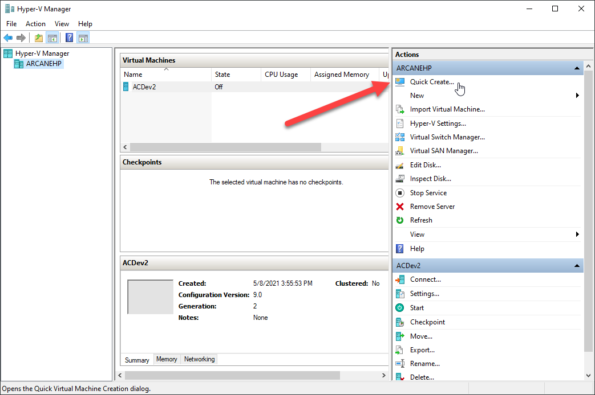
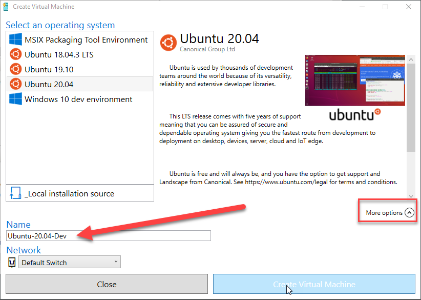
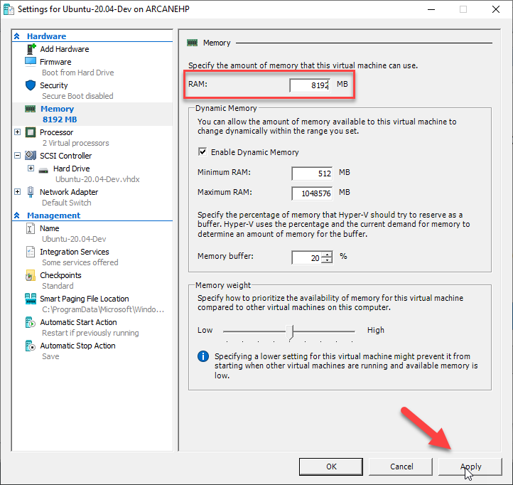
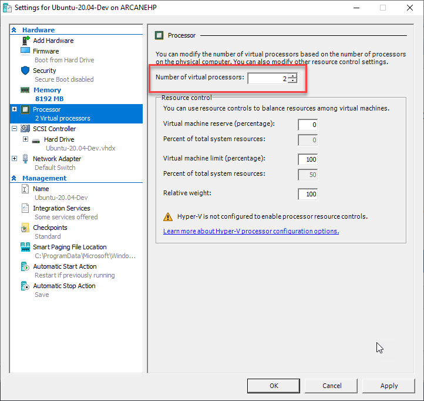
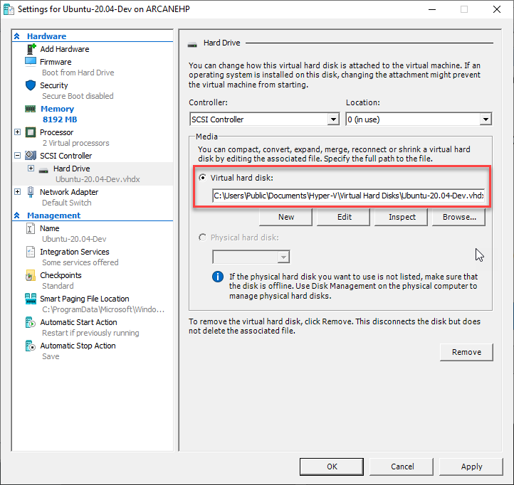
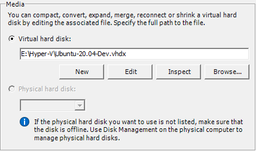
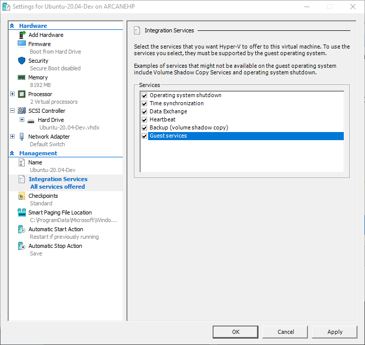
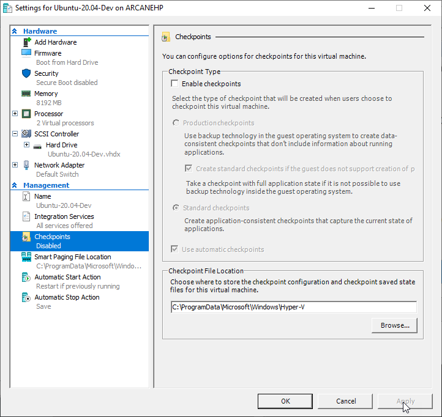

# Create the Ubuntu VM in Hyper-V using QuickStart

## Introduction

In this document you'll begin the process by using the QuickStart feature in Hyper-V to create an Ubuntu 20.04 virtual machine.

## Start with Hyper-V

Naturally your starting point is to open Hyper-V.

On the right, click on "Quick Create".

Select **Ubuntu 20.04**.

If you have multiple 20.04 instances, you may wish to click the **More options** drop down, and change the name, as I've done in this image.

Click **Create Virtual Machine**.

It will download Ubuntu 20.04, when done it will let you know.

Before we want to run it, we should click on the Edit settings button, so we can update some things.

## Edit settings

### Memory

Click on the Memory tab.

By default QuickStart sets up the VM with 2 gig of ram. I have a big machine, so I can easily devote 8 gig to the VM. I'll update the ram with 8192 MB (aka 8 GIG) as shown in the above image. You should set yours dependant on how much ram you think you'll need in the VM, balanced with how much physical ram is on your computer.

Here is a quick chart with different ram sizes you might want to use:

| Ram in GB | MB Value |
|------:|------:|
| 2 GB | 2048 |
| 4 GB | 4096 |
| 6 GB | 6144 |
| 8 GB | 8192 |
| 10 GB | 10240 |
| 12 GB | 12288 |
| 14 GB | 14336 |
| 16 GB | 16384 |
| 18 GB | 18432 |
| 20 GB | 20480 |
| 22 GB | 22528 |
| 24 GB | 24576 |
| 26 GB | 26624 |
| 28 GB | 28672 |
| 30 GB | 30720 |
| 32 GB | 32768 |

### Processor

Next you should review the Processor tab.

This should be set based on the required workload. If this will be the main VM I'll be using, and only using one VM at a time, I generally set it to a number that is half of my physical processor count.

On the computer I am writing this on, I have a four core i7 CPU, so I'll leave it at 2. I have another computer I use that has eight cores, so on that machine I might use 4 virtual processors.

### VHDX Location

The biggest annoyance I have with Quick Create is it doesn't ask me where to store the virtual hard disk, instead it puts in the default folder which is usually your C drive, `C:\Users\Public\Documents\Hyper-V\Virtual Hard Disks\`.

Click on the SCSI Controller, then expand the Hard Drive branch if it isn't expanded already. Click on the hard drive tab.

Look to see the name of the VHDX file that was generated, as well as where it was stored.

If you are like me, you will see better performance by putting your VHDX on a separate, physical hard drive than your operating system. In my computer I have a second physical drive, E, and in it is a folder Hyper-V where I store all my VHDX files.

What I'm going to do is open file explorer, and move the new VHDX file from the C Drive to my E Drive. Then I will click the Browse button, and pick out the VHDX file at its new location.

I'll click on Apply then move on to Integration Services.

### Integration Services

In the integration services tab, usually everything is checked except guest services.

Above I have added Guest Services. I'll now click Apply, and move to the last option.

### Checkpoints

Checkpoints are a personal preference. To be honest, I don't really care for them. In my mind, I'd rather restore the VHDX from a backup myself, or just blow it away and start over. Checkpoints can also leave a bunch of files laying around, and make it harder to copy the VM from one computer to another.

If you like them, great, keep using them. I'm going to uncheck the Enable Checkpoints box and click Apply.

## A note on rebooting

I have not had good luck getting Ubuntu to do a true reboot when running in a VM. It frequently comes up with a blank screen after the reboot, not letting me do anything.

So anywhere in these instructions you see "reboot", what you should really do is a full shut down of Ubuntu, then start your Ubuntu VM again from Hyper-V.

## Next Steps

At this point you are done with post QuickStart creation configuration. Click on OK to close the settings window. You are now returned to the "Virtual machine created successfully" window. I usually close the dialog, then start the VM from the main Hyper-V window.

You can now proceed to the next file, [2-Initial-Ubuntu-Configuration.md](2-Initial-Ubuntu-Configuration.md)

---

## Author Information

### Author

Robert C. Cain | [@ArcaneCode](https://twitter.com/arcanecode) | arcanecode@gmail.com

### Websites

About Me: [http://arcanecode.me](http://arcanecode.me)

Blog: [http://arcanecode.com](http://arcanecode.com)

Github: [http://arcanerepo.com](http://arcanerepo.com)

LinkedIn: [http://arcanecode.in](http://arcanecode.in)

### Copyright Notice

This document is Copyright (c) 2021 Robert C. Cain. All rights reserved.

The code samples herein is for demonstration purposes. No warranty or guarantee is implied or expressly granted.

This document may not be reproduced in whole or in part without the express written consent of the author. Information within can be used within your own projects.
